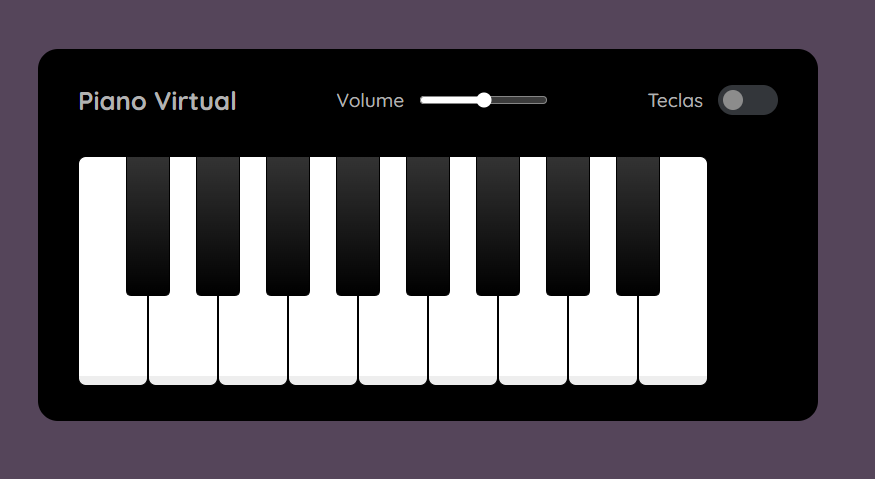

# 🎹 Piano Virtual

Projeto interativo que simula um teclado musical com sons reais, permitindo tocar notas via teclado ou clique do mouse de forma intuitiva.

---

## 🚀 Tecnologias usadas

  
  
  

---

## 🧠 O que eu pratiquei

- Manipulação de DOM com JavaScript
- Eventos de teclado e mouse
- Uso de `data-*` attributes
- Implementação de `Audio()` e controle de volume
- Toggle de classes com JavaScript

## 🖥️ Preview da Tela

  
---  

## 🎼 Funcionalidades

- 🎵 Tocar notas musicais com o teclado ou clique
- 🎚️ Controle de volume
- 🎹 Alternar exibição das letras nas teclas
- 💡 Destaque visual ao pressionar a tecla

> 💡[Clique aqui para jogar online](https://mirellanovroch.github.io/piano-simulator/)

> 📌 Este projeto ainda está em desenvolvimento e continuará recebendo melhorias conforme avanço nos meus estudos.

## ✍️  Créditos
Este piano virtual foi desenvolvido como parte de um projeto educacional da [Digital Innovation One](https://www.dio.me/).